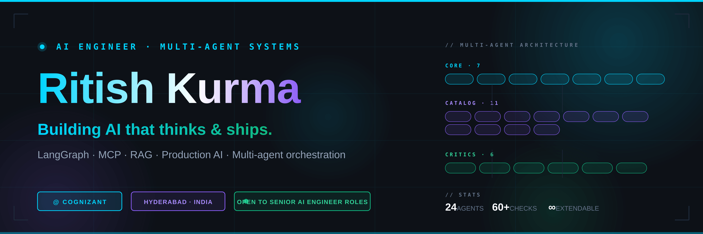

# Setup instructions — Pro GitHub profile

This folder contains everything you need to upgrade your `Ritish017/Ritish017` profile repo to a pro-level GitHub profile with custom banner, advanced widgets, and contribution snake animation.

## What's in this folder

```
github-profile-pro/
├── README.md                     ← Paste this into Ritish017/Ritish017/README.md
├── assets/
│   ├── banner.svg                ← Custom branded banner (referenced by README)
│   └── banner.png                ← PNG fallback (4167×1389, full quality)
├── .github/
│   └── workflows/
│       └── snake.yml             ← Generates the contribution snake animation
└── INSTRUCTIONS.md               ← This file
```

---

## Setup steps (10 minutes total)

### Step 1 — Open your profile repo

Go to `https://github.com/Ritish017/Ritish017` in your browser. This is your special profile repo (the one with the same name as your username).

If the repo doesn't exist yet:
1. Create a new repo named exactly `Ritish017`
2. Tick "Add a README"
3. Make it Public

### Step 2 — Clone it locally and replace files

In your terminal:

```bash
git clone https://github.com/Ritish017/Ritish017.git
cd Ritish017
```

Now copy the three things from this `github-profile-pro` folder into your local clone:

1. **Replace `README.md`** with the new one
2. **Create the `assets/` folder** and put `banner.svg` and `banner.png` inside
3. **Create `.github/workflows/` folders** and put `snake.yml` inside

Your final structure should look like:

```
Ritish017/
├── README.md
├── assets/
│   ├── banner.svg
│   └── banner.png
└── .github/
    └── workflows/
        └── snake.yml
```

### Step 3 — Commit and push

```bash
git add .
git commit -m "Upgrade profile to pro level: banner, advanced widgets, snake animation"
git push origin main
```

### Step 4 — Enable the snake animation

The snake won't show up immediately because the workflow needs to run once first.

1. Go to `https://github.com/Ritish017/Ritish017/actions`
2. You'll see "Generate Snake Animation" listed
3. Click on it
4. Click the **"Run workflow"** button on the right
5. Confirm by clicking the green **"Run workflow"** button
6. Wait about 30 seconds — it will create a new branch called `output` containing the snake SVGs
7. After it finishes, refresh your profile page (`github.com/Ritish017`)

The snake will now appear and auto-update every 12 hours forever.

### Step 5 — Pin your top repos

Go to your profile and click **"Customize your pins"**. Pick these 6 in this order:

1. `software-engineer-team` — your flagship multi-agent system
2. `codemigrator-ai` — your NVIDIA Nemotron showcase project
3. `claw-code` — your Rust experimentation
4. Your strongest ML project (`Sentiment-analysis` or `CNN`)
5. `customer-segmentation-project` — shows breadth
6. `BankCustomerChurnPrediction` — shows applied ML

Pinned repos render right below the README in your profile, so order matters.

---

## Troubleshooting

### The banner doesn't show up

The README references `./assets/banner.svg` which is a relative path. Make sure:
- The `assets/` folder is in the same repo as the README (i.e., `Ritish017/Ritish017/assets/banner.svg`)
- The file is named exactly `banner.svg` (case-sensitive)

If GitHub still doesn't render the SVG, you can switch to the PNG by changing this line in README.md:

```diff
- 
+ 
```

### The snake doesn't show up

The `output` branch needs to exist with the SVG files in it. After running the workflow once:
- Check `https://github.com/Ritish017/Ritish017/branches` — you should see an `output` branch
- Click on it and confirm `github-snake.svg` and `github-snake-dark.svg` are present

If the branch isn't being created, the workflow needs write permission. Go to:
- Repo Settings → Actions → General → Workflow permissions
- Select **"Read and write permissions"**
- Save

Then re-run the workflow.

### Stats widgets show old numbers

The widgets cache for a few hours. Force a refresh by adding a query param to the widget URL, like `&v=2`. Or just wait — they update automatically.

### A widget shows "Could not fetch user"

This happens if GitHub temporarily rate-limits the widget service (especially on weekends with high traffic). It fixes itself within an hour. No action needed.

---

## Customization tips

### Change the typing animation text

In the README, find the typing SVG URL and edit the `&lines=` parameter. Each line is separated by a `;`. Spaces in the text need to be `+` and special characters need to be URL-encoded.

### Change the color scheme

The whole README uses a dark navy + cyan + purple palette to match your `software-engineer-team` brand. To change colors, find these hex codes in the README and replace them globally:

- `00D4FF` — primary cyan accent
- `8B5CF6` — purple accent
- `10B981` — green accent
- `0D1117` — background dark navy

### Add or remove sections

Each major section is delimited by an HTML comment like `<!-- ═══ SECTION NAME ═══ -->`. Search for those to navigate the file. Delete or reorder freely.

### Replace the banner

The banner is an SVG you can edit in any text editor or design tool (Figma, Inkscape). Keep the dimensions at 1500×500 and re-export as both SVG and PNG.

---

## Why this is "pro level"

Most profile READMEs hit one or two of these. This one does all of them:

| Feature | Why it matters |
|---------|---------------|
| Custom branded banner | Shows visual design ability, not just code |
| Real bio, not bullet points | Senior devs write in sentences |
| Live pin cards (not screenshots) | Star/fork counts update automatically |
| Animated typing intro | Modern, eye-catching, professional |
| Activity graph | Shows you're actually active |
| Snake contribution game | Maybe 1% of profiles have this — instant credibility |
| Trophies | Subtle achievement display |
| Categorized tech stack | Signals depth, not just breadth |
| Status pills + open-to-work | Recruiters scan for these |
| Tokyo-night theming everywhere | Visual coherence shows attention to detail |
| Bio as Python class | Personality + signals you write Python |

---

That's it. Push it, run the workflow once, and you're done. The whole thing then maintains itself.
