<!--
  ╔═══════════════════════════════════════════════════════════════╗
  ║   GitHub Profile README · Ritish Kurma (@Ritish017)           ║
  ║   Save as: github.com/Ritish017/Ritish017/README.md           ║
  ║   Banner: place banner.svg in assets/ folder of same repo     ║
  ║   Snake: configure .github/workflows/snake.yml + Actions      ║
  ╚═══════════════════════════════════════════════════════════════╝
-->

<!-- ═══ HERO BANNER ═══════════════════════════════════════════════ -->
<div align="center">
  
</div>

<br/>

<!-- ═══ ANIMATED TYPING INTRO ═════════════════════════════════════ -->
<div align="center">

[](https://git.io/typing-svg)

</div>

<br/>

<!-- ═══ STATS BAR ═════════════════════════════════════════════════ -->
<div align="center">

[](https://www.linkedin.com/in/ritish-kurma/)
[](mailto:kurmaritish017@gmail.com)
[](https://github.com/Ritish017)

<br/>


<a href="https://github.com/Ritish017?tab=repositories"></a>

</div>

<br/>

<!-- ═══ ABOUT ════════════════════════════════════════════════════ -->

## 🧠 &nbsp;About me

I'm an AI Engineer who fell deep into the **agentic AI rabbit hole** — and decided to stay there.

I build **production AI systems**: multi-agent orchestration with LangGraph and CrewAI, RAG pipelines with full LangSmith observability, autonomous research agents, and production-grade safety layers with hallucination detection and guardrails.

Currently transitioning from full-stack development (.NET + Angular) into AI Engineering — specifically the design, orchestration, and reliability of intelligent agentic systems. The principle that drives most of my recent work:

> [!IMPORTANT]
> **Context is the failure mode of multi-agent systems. Not capability.**
> If your agents don't share what they know, no model upgrade saves you.

I don't just call OpenAI APIs. I architect intelligent systems that scale.

<br/>

<!-- ═══ FEATURED PROJECTS WITH LIVE PIN CARDS ═══════════════════ -->

## 🚀 &nbsp;Featured projects

<table>
<tr>
<td width="50%">
  <a href="https://github.com/Ritish017/codemigrator-ai">
    
  </a>
  <br/><br/>
  <strong>🌟 CodeMigrator AI</strong> — Multi-Agent Legacy Code Migration powered by NVIDIA Nemotron 3
  <br/><br/>
  Migrate enterprise legacy code (COBOL, Java EE) to Python in seconds using <strong>5 specialist AI agents</strong>. Showcase project for the NVIDIA Nemotron Workshop at <strong>IIIT Hyderabad (May 16, 2026)</strong>.
  <br/><br/>
  <code>Python</code> <code>LangGraph</code> <code>NVIDIA Nemotron</code> <code>FastAPI</code> <code>Next.js</code>
</td>
<td width="50%">
  <a href="https://github.com/Ritish017/software-engineer-team">
    
  </a>
  <br/><br/>
  <strong>🤖 Software Engineer Team</strong> — A 24-agent Claude Code system that takes any idea to a working web app
  <br/><br/>
  <strong>7 core + 11 catalog + 6 critics.</strong> Wave-based orchestration. Concrete quality checklists. Works for people with zero coding knowledge.
  <br/><br/>
  <code>Claude Code</code> <code>Multi-agent</code> <code>No-code</code> <code>Open Source</code>
</td>
</tr>
<tr>
<td width="50%">
  <strong>🛡️ AI Tech News Agent</strong>
  <br/><br/>
  Autonomous agent that posts AI news on X. It immediately started hallucinating. Then I fixed it with a multi-stage validation layer.
  <br/><br/>
  <code>LangGraph</code> <code>Gemini</code> <code>Tavily</code> <code>GitHub Actions</code> <code>Tweepy</code>
</td>
<td width="50%">
  <strong>🔍 Multimodal RAG Chatbot</strong>
  <br/><br/>
  Production-grade RAG system on Azure with full LangSmith observability. <strong>95% retrieval accuracy</strong> with end-to-end pipeline visibility.
  <br/><br/>
  <code>LangChain</code> <code>Azure OpenAI</code> <code>LangSmith</code> <code>Vector DB</code>
</td>
</tr>
</table>

<br/>

<!-- ═══ TECH STACK — CATEGORIZED ═════════════════════════════════ -->

## 🛠️ &nbsp;Tech stack

<details open>
<summary><strong>🤖 AI / Generative AI</strong></summary>
<br/>


</details>

<details open>
<summary><strong>☁️ Cloud & MLOps</strong></summary>
<br/>


</details>

<details open>
<summary><strong>💻 Languages & Frameworks</strong></summary>
<br/>


</details>

<details open>
<summary><strong>🗄️ Data & Storage</strong></summary>
<br/>


</details>

<br/>

<!-- ═══ CERTIFICATIONS ═══════════════════════════════════════════ -->

## 🏆 &nbsp;Certifications

<table>
<thead>
<tr>
<th align="left">Certification</th>
<th>Issuer</th>
<th align="center">Status</th>
</tr>
</thead>
<tbody>
<tr><td><strong>🎯 Azure AI Engineer Associate (AI-102)</strong></td><td>Microsoft</td><td align="center">✅ &nbsp;Certified</td></tr>
<tr><td><strong>🎯 Azure Fundamentals (AZ-900)</strong></td><td>Microsoft</td><td align="center">✅ &nbsp;Certified</td></tr>
<tr><td><strong>🎯 Context Engineering Foundation</strong></td><td>Cognizant</td><td align="center">✅ &nbsp;Certified</td></tr>
<tr><td><strong>🚧 Agentic AI Solutions Architect (AB-100)</strong></td><td>Microsoft</td><td align="center">🔄 &nbsp;In Progress</td></tr>
<tr><td><strong>🚧 Azure Developer Associate (AZ-204)</strong></td><td>Microsoft</td><td align="center">🔄 &nbsp;In Progress</td></tr>
</tbody>
</table>

<br/>

<!-- ═══ GITHUB STATS ═════════════════════════════════════════════ -->

## 📊 &nbsp;GitHub stats

<div align="center">

<a href="https://github.com/Ritish017">
  
  
</a>

<br/><br/>

<a href="https://github.com/Ritish017">
  
</a>

</div>

<br/>

### 📈 &nbsp;Activity graph

<div align="center">
  <a href="https://github.com/Ritish017">
    
  </a>
</div>

<br/>

### 🐍 &nbsp;Contribution snake

<div align="center">
  <picture>
    <source media="(prefers-color-scheme: dark)" srcset="https://raw.githubusercontent.com/Ritish017/Ritish017/output/github-snake-dark.svg" />
    <source media="(prefers-color-scheme: light)" srcset="https://raw.githubusercontent.com/Ritish017/Ritish017/output/github-snake.svg" />
    
  </picture>
</div>

<br/>

### 🏆 &nbsp;Trophies

<div align="center">
  <a href="https://github.com/ryo-ma/github-profile-trophy">
    
  </a>
</div>

<br/>

<!-- ═══ BIO AS CODE ══════════════════════════════════════════════ -->

## 🎯 &nbsp;What I'm building right now

```python
class Ritish:
    def __init__(self):
        self.role     = "AI Engineer"
        self.company  = "Cognizant"
        self.location = "Hyderabad, India"

    def current_focus(self) -> list[str]:
        return [
            "Multi-agent systems with LangGraph & CrewAI",
            "MCP (Model Context Protocol) servers",
            "Production-grade RAG pipelines with observability",
            "Hallucination detection + guardrails",
            "Agentic AI architecture patterns",
        ]

    def shipping_soon(self) -> list[str]:
        return [
            "CodeMigrator AI → NVIDIA workshop @ IIIT Hyderabad (May 16, 2026)",
            "Software Engineer Team → open sourcing this week",
            "Agentic AI Solutions Architect (AB-100) certification",
        ]

    def open_to(self) -> list[str]:
        return [
            "Senior AI Engineer roles (remote/hybrid)",
            "Open source agentic AI collaborations",
            "Multi-agent system architecture discussions",
            "Mentoring junior AI engineers",
        ]

    def fun_fact(self) -> str:
        return "I broke my AI agent. It taught me more than any tutorial."

    def say_hi(self) -> str:
        return "Thanks for visiting. Let's build something that actually works."


me = Ritish()
print(me.say_hi())
```

<br/>

<!-- ═══ CONTRIBUTION VISUAL ══════════════════════════════════════ -->

## 🌐 &nbsp;Where to find me

<div align="center">

<a href="https://www.linkedin.com/in/ritish-kurma/">
  
</a>
<a href="mailto:kurmaritish017@gmail.com">
  
</a>
<a href="https://github.com/Ritish017">
  
</a>
<a href="https://github.com/Ritish017?tab=repositories">
  
</a>

</div>

<br/>

## 🤝 &nbsp;I'm open to collaborating on

<table>
<tr>
<td width="33%" align="center" valign="top">
<h3>🤖</h3>
<strong>AI Agent Systems</strong>
<br/><br/>
Multi-agent orchestration · Tool use · Autonomous coding · Reliability engineering
</td>
<td width="33%" align="center" valign="top">
<h3>🚀</h3>
<strong>Production AI</strong>
<br/><br/>
RAG with observability · Hallucination detection · MLOps · Real users, real edge cases
</td>
<td width="33%" align="center" valign="top">
<h3>🌱</h3>
<strong>Open Source</strong>
<br/><br/>
Anything in the Claude Code · LangGraph · MCP ecosystem · Code migration tooling
</td>
</tr>
</table>

<br/>

<!-- ═══ CLOSING ══════════════════════════════════════════════════ -->

<div align="center">

### 💭 &nbsp;A question I'm sitting with right now


<br/>

---

<sub>⭐ &nbsp;<strong>If you find anything useful here, drop a star — it tells me what to build more of.</strong></sub>

<br/>

<sub>Built with care · Auto-updated daily · 2026 · <a href="https://github.com/Ritish017">@Ritish017</a></sub>

</div>
